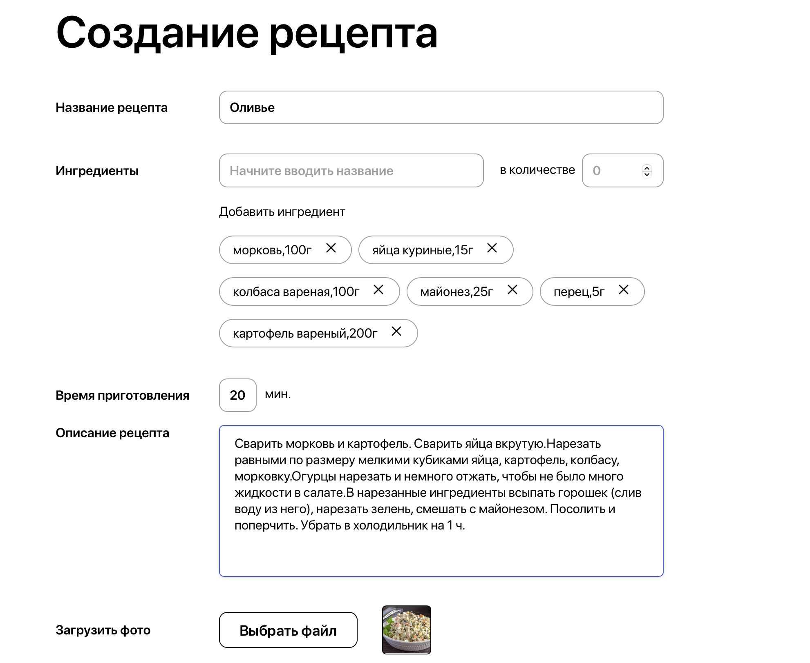

# Foodgram

Foodgram - это социальная сеть для обмена рецептами. Пользователи могут публиковать свои рецепты, подписываться на других пользователей, добавлять рецепты в избранное и создавать списки покупок.

## Технологии

### Backend
- Python 3.9+
- Django 3.2
- Django REST Framework
- PostgreSQL
- Docker
- Nginx

### Frontend
- React
- JavaScript
- HTML/CSS
- Docker
- Nginx

## Структура проекта

```
foodgram/
├── backend/               # Django backend приложение
│   ├── api/              # API endpoints и сериализаторы
│   ├── ingredient/       # Модели и логика для ингредиентов
│   ├── recipes/          # Модели и логика для рецептов
│   ├── users/            # Модели и логика для пользователей
│   ├── foodgram/         # Основные настройки Django проекта
│   ├── const/            # Константы и утилиты
│   ├── data/             # Данные для загрузки (ингредиенты)
│   ├── manage.py         # Django management script
│   └── requirements.txt  # Зависимости Python
├── frontend/             # React frontend приложение
├── infra/               # Docker и Nginx конфигурации
├── docs/                # Документация и скриншоты
│   └── screenshots/     # Скриншоты приложения
├── postman_collection/  # Postman коллекция для тестирования API
└── .github/             # GitHub Actions конфигурации
```

## Основные функции

- Регистрация и авторизация пользователей
- Создание, редактирование и удаление рецептов
- Подписка на других пользователей
- Добавление рецептов в избранное
- Создание списка покупок
- Фильтрация рецептов по тегам
- API для взаимодействия с приложением

## Установка и запуск

### Требования
- Docker
- Docker Compose

### Локальный запуск

1. Клонируйте репозиторий:
```bash
git clone https://github.com/PinGBin74/foodgram-st.git
cd foodgram
```

2. Создайте файл .env в директории backend со следующими переменными:
```
DB_ENGINE=django.db.backends.postgresql
DB_NAME=postgres
POSTGRES_USER=postgres
POSTGRES_PASSWORD=postgres
DB_HOST=db
DB_PORT=5432
```

3. Перейти в папку frontend:
```bash
cd fronend
```

4. Выполнить две команды:
```bash
npm install --legacy-peer-deps
npm run build
```

5. Запустите проект с помощью Docker Compose:
```bash

cd .. && cd infra && docker-compose up --build
```


После этого проект будет доступен по адресу http://localhost/

## API Endpoints

API документация доступна по адресу http://localhost/api/docs/

Основные эндпоинты:
- `/api/users/` - управление пользователями
- `/api/recipes/` - управление рецептами
- `/api/ingredients/` - управление ингредиентами

## Скриншоты приложения

### Создание рецепта

Интерфейс создания нового рецепта, где пользователь может указать название, описание, время приготовления, ингредиенты и шаги приготовления.

### Готовый рецепт

Пример готового рецепта с полным описанием, списком ингредиентов и пошаговыми инструкциями.

### Редактирование рецепта

Страница редактирования рецепта, позволяющая изменить все детали существующего рецепта.

### Список покупок

Интерфейс списка покупок, где пользователь может видеть все необходимые ингредиенты для выбранных рецептов.

### Экспорт списка покупок

Пример экспортированного списка покупок в формате CSV.

